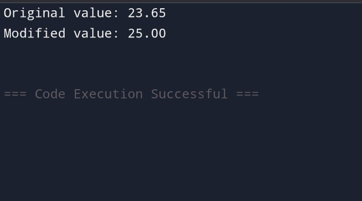
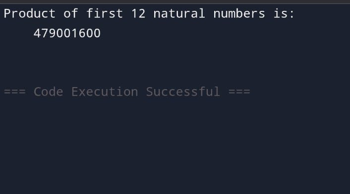
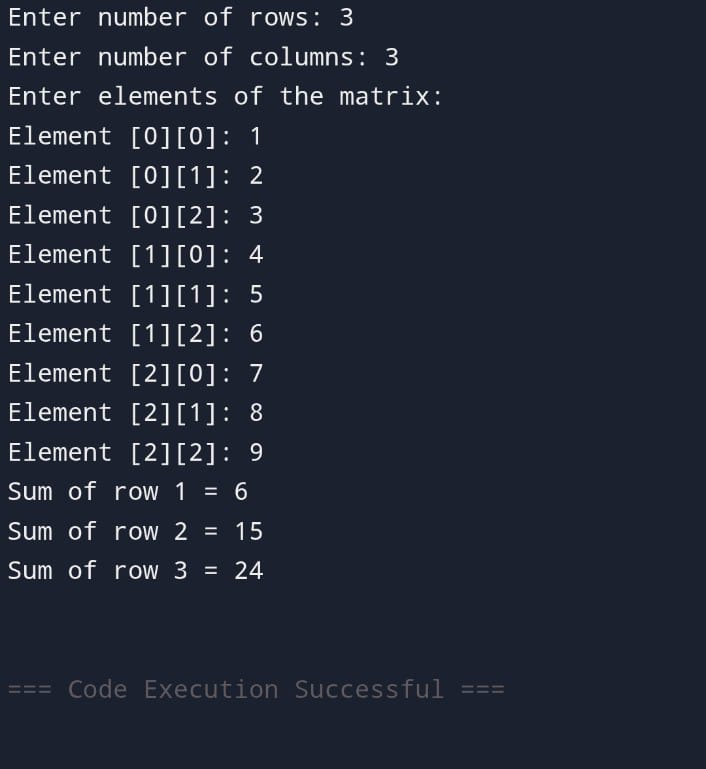
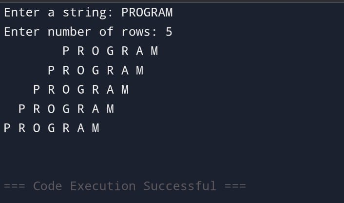
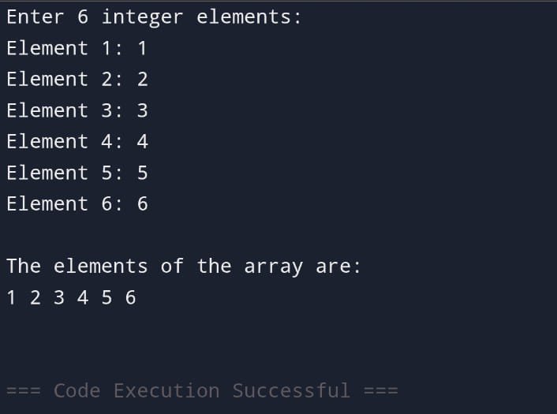

EX-21-POINTERS
# AIM:
Write a C program to convert a 23.65 into 25 using pointer

## ALGORITHM:
1.	Declare a double variable to hold the floating-point number (23.65).
2.	Declare a pointer to double to point to the address of the variable.
3.	Use the pointer to modify the value to 25.0.
4.	Print the modified value.

## PROGRAM:
```
#include <stdio.h>

int main() {
    // 1. Declare and initialize a float variable.
    float num = 23.65;
    
    // 2. Declare a float pointer and store the address of the variable `num`.
    float *ptr_float = &num;
    
    // 3. Declare an integer variable to store the final, rounded value.
    int result;
    
    // 4. Implement a rounding logic. Since 0.65 is greater than 0.5, we add 1 to the integer part.
    // The conditional operator `(condition) ? value_if_true : value_if_false` is used for this logic.
    // The dereferenced pointer `*ptr_float` accesses the value of `num`.
    result = (*ptr_float > 0) ? (int)(*ptr_float + 0.5) : (int)(*ptr_float - 0.5);
    
    // 5. Print the original and the converted values.
    printf("Original float value: %.2f\n", num);
    printf("Converted integer value (using pointer): %d\n", result);
    
    return 0;
}

```

## OUTPUT:
 	





## RESULT:
Thus the program to convert a 23.65 into 25 using pointer has been executed successfully.
 
 


# EX-22-FUNCTIONS AND STORAGE CLASS

## AIM:

Write a C program to calculate the Product of first 12 natural numbers using Recursion

## ALGORITHM:

1.	Define a recursive function calculateProduct that takes an integer parameter n.
2.	Return n multiplied by the result of the calculateProduct function called with n - 1.
3.	Declare an integer variable n and an unsigned long long variable product.
4.	Initialize n with the value 12 (for the first 12 natural numbers).
5.	Call the calculateProduct function with n and store the result in the product variable.
6.	Print the result, indicating it is the product of the first 12 natural numbers.

## PROGRAM:
```
#include <stdio.h>

// Recursive function to calculate the product of first 'n' natural numbers
long long productOfNaturalNumbers(int n) {
    // Base case: If n is 1, the product is 1
    if (n == 1) {
        return 1;
    } 
    // Recursive case: Multiply n with the product of first (n-1) natural numbers
    else {
        return (long long)n * productOfNaturalNumbers(n - 1);
    }
}

int main() {
    int num = 12;
    long long result;

    result = productOfNaturalNumbers(num);

    printf("The product of the first %d natural numbers is: %lld\n", num, result);

    return 0;
}
```
## OUTPUT:

         		
## RESULT:

Thus the program has been executed successfully.
 
 


# EX-23-ARRAYS AND ITS OPERATIONS

## AIM:

Write C Program to find Sum of each row of a Mxatri

## ALGORITHM:

1.	Declare and initialize the matrix with the desired values.
2.	Create a loop to iterate through each row of the matrix.
3.	Inside the loop, calculate the sum of the elements in each row.
4.	Print the sum for each row.

## PROGRAM:
```
#include <stdio.h>

int main() {
    int rows, cols;

    // Get the number of rows and columns from the user
    printf("Enter the number of rows: ");
    scanf("%d", &rows);
    printf("Enter the number of columns: ");
    scanf("%d", &cols);

    int matrix[rows][cols]; // Declare a 2D array (matrix)

    // Get the matrix elements from the user
    printf("Enter the matrix elements:\n");
    for (int i = 0; i < rows; i++) {
        for (int j = 0; j < cols; j++) {
            printf("Enter element [%d][%d]: ", i + 1, j + 1);
            scanf("%d", &matrix[i][j]);
        }
    }

    // Calculate and print the sum of each row
    printf("\nSum of each row:\n");
    for (int i = 0; i < rows; i++) {
        int rowSum = 0; // Initialize sum for the current row
        for (int j = 0; j < cols; j++) {
            rowSum += matrix[i][j]; // Add element to the row sum
        }
        printf("Sum of Row %d: %d\n", i + 1, rowSum);
    }

    return 0;
}
```


## OUTPUT:



 
 

## RESULT:
The given C program has successfully runned and the output is verified without an error.

 


# EX-24-STRINGS

## AIM:

Write C program for the below pyramid string pattern. Enter a string: PROGRAM Enter number of rows: 5 P R O G R A M P R O G R A M P R O G R A M

## ALGORITHM:

1.	Input the number of rows for the pyramid (e.g., num_rows).
2.	Initialize variables:i for the row count (starting from 1),j for the character count (starting from 1)
3.	Start a loop for i from 1 to num_rows (for each row of the pyramid).
4.	Calculate the midpoint position as midpoint = (2 * num_rows - 1) / 2.
5.	End the program.

## PROGRAM:
```
#include <stdio.h>
#include <string.h>

int main() {
    char str[100]; // Assuming a maximum string length of 99 characters
    int num_rows;
    int str_len;

    printf("Enter a string: ");
    scanf("%s", str); // Reads the string until a whitespace is encountered

    printf("Enter number of rows: ");
    scanf("%d", &num_rows);

    str_len = strlen(str);

    for (int i = 0; i < num_rows; i++) {
        // Print leading spaces for pyramid alignment
        for (int j = 0; j < (num_rows - 1 - i); j++) {
            printf(" ");
        }

        // Print the string characters, cycling through them if the string is shorter than the row length
        for (int k = 0; k <= i; k++) {
            printf("%c ", str[k % str_len]);
        }
        printf("\n");
    }

    return 0;
}
```


 ## OUTPUT:


 

## RESULT:

Thus the C program to String process executed successfully
 

 


# EX -25 –DISPLAYING ARRAYS USING POINTERS
## AIM:

Write a c program to read and display an array of any 6 integer elements using pointer

## ALGORITHM:
Step 1: Start the program.
Step 2: Declare the following:
•	Integer variable i for iteration.
•	Integer variable n to store the number of elements.
•	Integer array arr[10] to hold up to 10 elements.
•	Integer pointer parr and initialize it to point to the array arr.
Step 3: Read the value of n (number of elements) from the user.
Step 4: Loop from i = 0 to i < n:
•	Read an integer value and store it in the address parr + i using pointer arithmetic.
Step 5: Loop from i = 0 to i < n:
•	Print the element at *(parr + i) using pointer dereferencing.
Step 6: End the program.

## PROGRAM:
```
#include <stdio.h>

int main() {
    int arr[6]; // Declare an array of 6 integers
    int *ptr;   // Declare a pointer to an integer

    ptr = arr;  // Assign the base address of the array to the pointer

    printf("Enter 6 integer elements:\n");
    for (int i = 0; i < 6; i++) {
        printf("Element %d: ", i + 1);
        scanf("%d", (ptr + i)); // Read input into array elements using pointer arithmetic
    }

    printf("\nDisplaying array elements:\n");
    for (int i = 0; i < 6; i++) {
        printf("Element %d: %d\n", i + 1, *(ptr + i)); // Display array elements using pointer dereferencing
    }

    return 0;
}
```

## OUTPUT:


 

## RESULT:

Thus the C program to read and display an array of any 6 integer elements using pointer has been executed


